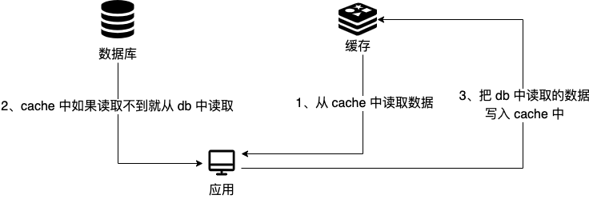

# 缓存常用的 3 种读写策略

### 旁路缓存模式 Cache Aside Pattern

**Cache Aside Pattern：使用比较多的一个缓存读写模式，适合读请求比较多的场景**

Cache Aside Pattern 中服务端需要同时维系 db 和 cache，并且是以 db 的结果为准

下面我们来看一下这个策略模式下的缓存读写步骤

**写**：

- 先更新 db
- 然后直接删除 cache 

**读** :

- 从 cache 中读取数据，读取到就直接返回
- cache 中读取不到的话，就从 db 中读取数据返回
- 再把数据放到 cache 中

❓「**在写数据的过程中，可以先删除 cache ，后更新 db 么？**」

**答案：** ==不行！==因为这样可能会造成 **数据库（db）和缓存（Cache）数据不一致**的问题

举例：请求 1 先写数据 A，请求 2 随后读数据 A 的话，就很有可能产生数据不一致性的问题

这个过程可以简单描述为：

> 请求 1 先把 cache 中的 A 数据删除 -> 请求 2 从 db 中读取数据->请求 1 再把 db 中的 A 数据更新

❓「**在写数据的过程中，先更新 db，后删除 cache 就没有问题了么？**」

**答案：** 理论上来说还是可能会出现数据不一致性的问题，不过概率非常小，因为缓存的写入速度是比数据库的写入速度快很多

举例：请求 1 先读数据 A，请求 2 随后写数据 A，并且数据 A 在请求 1 请求之前不在缓存中的话，也有可能产生数据不一致性的问题

这个过程可以简单描述为：

> 请求 1 从 db 读数据 A-> 请求 2 更新 db 中的数据 A（此时缓存中无数据 A ，故不用执行删除缓存操作 ） -> 请求 1 将数据 A 写入 cache

现在我们再来分析一下 **Cache Aside Pattern 的缺陷**

**缺陷 1：首次请求数据一定不在 cache 的问题**

解决办法：可以将热点数据可以提前放入 cache 中

**缺陷 2：写操作比较频繁的话导致 cache 中的数据会被频繁被删除，这样会影响缓存命中率 **

解决办法：

- 数据库和缓存数据强一致场景：更新 db 的时候同样更新 cache，不过我们需要加一个锁/分布式锁来保证更新 cache 的时候不存在线程安全问题
- 可以短暂地允许数据库和缓存数据不一致的场景：更新 db 的时候同样更新 cache，但是给缓存加一个比较短的过期时间，这样的话就可以保证即使数据不一致的话影响也比较小

### 读写穿透模式 Read / Write Through Pattern

该策略中，服务端把 cache 视为主要数据存储，从中读取数据并将数据写入其中。cache 服务负责将此数据读取和写入 db，从而减轻了应用程序的职责

这种缓存读写策略在平时在开发过程中非常少见。抛去性能方面的影响，大概率是因为经常使用的分布式缓存 Redis 并没有提供 cache 将数据写入 db 的功能

**写（Write Through）**

- 先查 cache，cache 中不存在，直接更新 db
- cache 中存在，则先更新 cache，然后 cache 服务自己更新 db（**同步更新 cache 和 db**）

简单画了一张图帮助大家理解写的步骤

**读（Read Through）**

- 从 cache 中读取数据，读取到就直接返回
- 读取不到的话，先从 db 加载，写入到 cache 后返回响应

简单画了一张图帮助大家理解读的步骤

Read-Through Pattern 实际只是在 Cache-Aside Pattern 之上进行了封装

在 Cache-Aside Pattern 下，发生读请求的时候，如果 cache 中不存在对应的数据，是由客户端自己负责把数据写入 cache，而 Read Through Pattern 则是 cache 服务==自己来写入==缓存的，这对客户端是透明的

和 Cache Aside Pattern 一样， Read-Through Pattern 也有首次请求数据一定不再 cache 的问题，对于热点数据可以提前放入缓存中

### 异步缓存写入模式：Write Behind Pattern

Write Behind Pattern 和 Read/Write Through Pattern 很相似，两者都是由 cache 服务来负责 cache 和 db 的读写

但是，两个又有很大的不同：**Read/Write Through 是==同步更新==cache 和 db，而 Write Behind 则是只更新缓存，不直接更新 db，而是改为异步批量的方式来更新 db。**

很明显，这种方式对数据一致性带来了更大的挑战，比如 cache 数据可能还没异步更新 db 的话，cache 服务可能就就挂掉了

这种策略非常少见，但是不代表它的应用场景少，比如

- 消息队列中消息的异步写入磁盘
- MySQL 的 Innodb Buffer Pool 机制

Write Behind Pattern 下 db 的写性能非常高，非常适合一些数据经常变化又对数据一致性要求没那么高的场景，比如浏览量、点赞量
